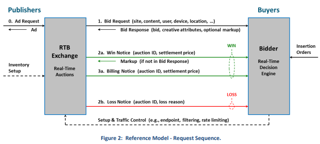

# AlphaM RTB 연동 가이드

## 📑 목차

- [1. AlphaM RTB 소개](#1-alpham-rtb-소개)
  - [1.1. AlphaM RTB](#11-alpham-rtb)
  - [1.2. AlphaM 광고 소재](#12-alpham-광고-소재)
- [2. OpenRTB Request Sequence](#2-openrtb-request-sequence)
- [3. 입찰 요청 (Bid Request Specification)](#3-입찰-요청-bid-request-specification)
  - [3.1. Object Model](#31-object-model)
  - [3.2. Object Specifications](#32-object-specifications)
    - [3.2.1. Object: BidRequest](#321-object-bidrequest)
    - [3.2.2. Object: Imp](#322-object-imp)
    - [3.2.3. Object: Banner](#323-object-banner)
    - [3.2.4. Object: Site](#324-object-site)
    - [3.2.5. Object: App](#325-object-app)
    - [3.2.6. Object: Publisher](#326-object-publisher)
    - [3.2.7. Object: Device](#327-object-device)
    - [3.2.8. Object: Geo](#328-object-geo)
    - [3.2.9. Object: User](#329-object-user)
- [4. 입찰 응답 (Bid Response Specification)](#4-입찰-응답-bid-response-specification)
  - [4.1. Object Model](#41-object-model)
  - [4.2. Object Specifications](#42-object-specifications)
    - [4.2.1. Object: BidResponse](#421-object-bidresponse)
    - [4.2.2. Object: SeatBid](#422-object-seatbid)
    - [4.2.3. Object: Bid](#423-object-bid)
- [5. 예제](#5-예제)
  - [5.1. 입찰 요청 예제 (Bid Requests)](#51-입찰-요청-예제-bid-requests)
    - [5.1.1. Display 광고 요청](#511-display-광고-요청)
  - [5.2. 입찰 응답 예제 (Bid Responses)](#52-입찰-응답-예제-bid-responses)
    - [5.2.1. Display 광고 응답](#521-display-광고-응답)
- [6. ✅ 유효성 검사](#6-✅-유효성-검사)
- [7. ❌ No-Bid 신호](#7-❌-no-bid-신호)
  - [7.1. 간단한 HTTP 응답](#71-간단한-http-응답)
  - [7.2. 빈 JSON 객체](#72-빈-json-객체)
  - [7.3. 구조화된 No-Bid 응답](#73-구조화된-no-bid-응답)
  - [7.4. 이유 코드 포함 No-Bid](#74-이유-코드-포함-no-bid)
  - [7.5. 모범 사례](#75-모범-사례)
- [8. 🛠 사용 시 참고사항](#8-🛠-사용-시-참고사항)
- [9. 📚 참고 링크](#9-📚-참고-링크)

---

## 1. AlphaM RTB 소개

### 1.1. AlphaM RTB
AlphaM BID Server와 매체간 OpenRTB 프로토콜 연동 방법을 안내합니다.
AlphaM RTB는 IAB Tech Lab에서 관리하는 [OpenRTB API Spec v2.5 final](https://www.iab.com/guidelines/real-time-bidding-rtb-project/)를 기반으로 개발됩니다.

### 1.2. AlphaM 광고 소재
- 디스플레이 배너
   - 광고 소재를 json 형태로 전달합니다.
- Native 배너 (beta)
   - OpenRTB Native Spec 에 따라 Native 랜더링에 필요한 소재 정보를 json 형태로 전달합니다.

---

## 2. OpenRTB Request Sequence
다음 그림은 Ad Exchange - Bidder간의 OpenRTB 상호작용을 보여줍니다.
게시자 사이트, 어플리케이션에서 광고 요청이 시작되면, 입찰 요청은 모든 Bidder들에게 전파되고 Bidder로 부터 온 응답들이 경매 룰에 의해 평가되어 낙찰자(Winner)를 선정합니다.
낙찰자(Winner)에게는 경매 성공을 통보하고, 광고 마크업(Markup)이 Ad Exchange로 전달됩니다.



실제 비용 적용 여부와 낙찰 실패 사유를 입찰자에게 알려줍니다.
이 모든 알림에는 가격 등 핵심 정보를 전달하는 매크로가 포함될 수 있습니다.

---

## 3. 입찰 요청 (Bid Request Specification)
입찰 요청은 Imp(impression)등의 아래 Obeject들로 구성됩니다.

### 3.1. Object Model
BidRequest는 JSON 구조에서 최상위 객체이며, 이 객체는 광고 입찰 요청의 전체 정보를 담고 있습니다. 그 하위 객체 중 Imp(Impression)는 반드시 포함되어야 하는 필수 항목으로, 실제 판매 대상인 광고 노출 정보를 담고 있습니다. 각 Imp는 광고 유형을 정의하기 위해 최소 하나 이상의 다음 객체 중 하나를 포함해야 합니다:
- Banner
- Video
- Audio
- Native

단, 입찰은 항상 이 중 하나의 유형에 대해서만 이뤄집니다.
또한, 각 인벤토리는 **프라이빗 마켓플레이스(PMP)**의 대상이 될 수도 있습니다.

그 외 하위 객체들은 입찰자가 타겟팅 및 가격 책정을 할 때 참고할 수 있도록 다음과 같은 다양한 정보들을 제공합니다:
- 사용자(User)
- 사용 기기(Device)
- 위치 정보(Geo)
- 규제 조건(Regs)
- 노출될 콘텐츠 정보(Content)

특히 콘텐츠는 웹사이트(Site) 또는 앱(App) 중 하나에 속해야 하며, 두 개를 동시에 포함할 수는 없습니다. 이는 내부적으로 DistributionChannel이라는 추상 개념으로 표현됩니다.
모든 객체에는 표준 외의 정보를 전달하기 위한 **확장 객체(ext)**를 포함할 수 있으며, 이는 교환소(Exchange)별로 자유롭게 정의됩니다. 교환소는 자신이 사용하는 확장 구조를 입찰자들에게 문서화해야 합니다.
요약하자면, BidRequest 모델은 필수적으로 Imp를 포함하며, 다양한 보조 정보를 통해 입찰자의 정밀 타겟팅을 돕고, 사이트 또는 앱 중 하나를 기반으로 하며, 확장 가능성을 염두에 둔 구조입니다.

### 3.2. Object Specifications

#### 3.2.1. Object: BidRequest
<table border="1" cellspacing="0" cellpadding="6" style="width:100%;">
  <thead style="background-color:#f2f2f2">
    <tr>
      <th>Attribute</th>
      <th>Type</th>
      <th>Description</th>
    </tr>
  </thead>
  <tbody>
<tr><td>id</td><td>string; required</td><td>Unique ID of the bid request, provided by the exchange.</td></tr>
<tr><td>at</td><td>integer; default 2</td><td>Auction type, 1 = First Price, 2 = Second Price Plus.</td></tr>
<tr><td>cur</td><td>string array</td><td>Allowed currencies using ISO-4217 codes.</td></tr>
<tr><td>imp</td><td>object array; required</td><td>Array of Imp objects representing the impressions offered.</td></tr>
<tr><td>site</td><td>object; recommended</td><td>Details about the publisher’s website.</td></tr>
<tr><td>app</td><td>object; recommended</td><td>Details about the publisher’s app.</td></tr>
<tr><td>device</td><td>object; recommended</td><td>Details about the user’s device.</td></tr>
<tr><td>user</td><td>object; recommended</td><td>Details about the human user of the device.</td></tr>
<tr><td>test</td><td>integer; default 0</td><td>Test mode flag, 0 = live, 1 = test.</td></tr>
<tr><td>bcat</td><td>string array</td><td>Blocked advertiser categories.</td></tr>
<tr><td>badv</td><td>string array</td><td>Blocked advertiser domains.</td></tr>
<tr><td>bapp</td><td>string array</td><td>Blocked app identifiers.</td></tr>
  </tbody>
</table>

#### 3.2.2. Object: Imp
<table border="1" cellspacing="0" cellpadding="6" style="width:100%;">
  <thead style="background-color:#f2f2f2">
    <tr>
      <th>Attribute</th>
      <th>Type</th>
      <th>Description</th>
    </tr>
  </thead>
  <tbody>
<tr><td>id</td><td>string; required</td><td>Identifier for this impression.</td></tr>
<tr><td>banner</td><td>object</td><td>Banner object if this impression is display.</td></tr>
<tr><td>native</td><td>object</td><td>Native object if this impression is native.</td></tr>
<tr><td>tagid</td><td>string</td><td>Identifier for specific ad placement.</td></tr>
<tr><td>bidfloor</td><td>float</td><td>Minimum bid for this impression.</td></tr>
  </tbody>
</table>

#### 3.2.3. Object: Banner
<table border="1" cellspacing="0" cellpadding="6" style="width:100%;">
  <thead style="background-color:#f2f2f2">
    <tr>
      <th>Attribute</th>
      <th>Type</th>
      <th>Description</th>
    </tr>
  </thead>
  <tbody>
<tr><td>w</td><td>integer</td><td>Width of the banner in pixels.</td></tr>
<tr><td>h</td><td>integer</td><td>Height of the banner in pixels.</td></tr>
<tr><td>pos</td><td>integer</td><td>Ad position on screen.</td></tr>
<tr><td>btype</td><td>integer array</td><td>Blocked creative types.</td></tr>
  </tbody>
</table>

#### 3.2.4. Object: Site
<table border="1" cellspacing="0" cellpadding="6" style="width:100%;">
  <thead style="background-color:#f2f2f2">
    <tr>
      <th>Attribute</th>
      <th>Type</th>
      <th>Description</th>
    </tr>
  </thead>
  <tbody>
<tr><td>id</td><td>string</td><td>Site ID.</td></tr>
<tr><td>name</td><td>string</td><td>Site name.</td></tr>
<tr><td>domain</td><td>string</td><td>Domain of the site.</td></tr>
<tr><td>cat</td><td>string array</td><td>Content categories.</td></tr>
<tr><td>publisher</td><td>object</td><td>Publisher object.</td></tr>
<tr><td>page</td><td>string</td><td>Page URL.</td></tr>
<tr><td>ref</td><td>string</td><td>Referrer URL.</td></tr>
  </tbody>
</table>

#### 3.2.5. Object: App
<table border="1" cellspacing="0" cellpadding="6" style="width:100%;">
  <thead style="background-color:#f2f2f2">
    <tr>
      <th>Attribute</th>
      <th>Type</th>
      <th>Description</th>
    </tr>
  </thead>
  <tbody>
<tr><td>id</td><td>string</td><td>App ID.</td></tr>
<tr><td>name</td><td>string</td><td>App name.</td></tr>
<tr><td>bundle</td><td>string</td><td>App bundle/package name.</td></tr>
<tr><td>storeurl</td><td>string</td><td>App store URL.</td></tr>
<tr><td>cat</td><td>string array</td><td>Content categories.</td></tr>
<tr><td>publisher</td><td>object</td><td>Publisher object.</td></tr>
<tr><td>ver</td><td>string</td><td>App version.</td></tr>
  </tbody>
</table>

#### 3.2.6. Object: Publisher
<table border="1" cellspacing="0" cellpadding="6" style="width:100%;">
  <thead style="background-color:#f2f2f2">
    <tr>
      <th>Attribute</th>
      <th>Type</th>
      <th>Description</th>
    </tr>
  </thead>
  <tbody>
<tr><td>id</td><td>string</td><td>Publisher ID.</td></tr>
<tr><td>name</td><td>string</td><td>Publisher name.</td></tr>
<tr><td>cat</td><td>string array</td><td>Content categories.</td></tr>
<tr><td>domain</td><td>string</td><td>Publisher domain.</td></tr>
<tr><td>ext</td><td>object</td><td>Exchange-specific extensions.</td></tr>
  </tbody>
</table>

#### 3.2.7. Object: Device
<table border="1" cellspacing="0" cellpadding="6" style="width:100%;">
  <thead style="background-color:#f2f2f2">
    <tr>
      <th>Attribute</th>
      <th>Type</th>
      <th>Description</th>
    </tr>
  </thead>
  <tbody>
<tr><td>ua</td><td>string</td><td>User agent.</td></tr>
<tr><td>ip</td><td>string</td><td>IPv4 address.</td></tr>
<tr><td>ipv6</td><td>string</td><td>IPv6 address.</td></tr>
<tr><td>devicetype</td><td>integer</td><td>Device type.</td></tr>
<tr><td>make</td><td>string</td><td>Device make.</td></tr>
<tr><td>model</td><td>string</td><td>Device model.</td></tr>
<tr><td>os</td><td>string</td><td>Operating system.</td></tr>
<tr><td>geo</td><td>object</td><td>Geo object.</td></tr>
  </tbody>
</table>

#### 3.2.8. Object: Geo
<table border="1" cellspacing="0" cellpadding="6" style="width:100%;">
  <thead style="background-color:#f2f2f2">
    <tr>
      <th>Attribute</th>
      <th>Type</th>
      <th>Description</th>
    </tr>
  </thead>
  <tbody>
<tr><td>lat</td><td>float</td><td>Latitude.</td></tr>
<tr><td>lon</td><td>float</td><td>Longitude.</td></tr>
<tr><td>country</td><td>string</td><td>Country code.</td></tr>
<tr><td>region</td><td>string</td><td>Region.</td></tr>
<tr><td>city</td><td>string</td><td>City.</td></tr>
<tr><td>zip</td><td>string</td><td>Postal code.</td></tr>
<tr><td>ext</td><td>object</td><td>Exchange-specific extensions.</td></tr>
  </tbody>
</table>

#### 3.2.9. Object: User
<table border="1" cellspacing="0" cellpadding="6" style="width:100%;">
  <thead style="background-color:#f2f2f2">
    <tr>
      <th>Attribute</th>
      <th>Type</th>
      <th>Description</th>
    </tr>
  </thead>
  <tbody>
<tr><td>id</td><td>string</td><td>Exchange-specific ID.</td></tr>
<tr><td>buyeruid</td><td>string</td><td>Buyer-specific ID.</td></tr>
<tr><td>yob</td><td>integer</td><td>Year of birth.</td></tr>
<tr><td>gender</td><td>string</td><td>Gender.</td></tr>
<tr><td>keywords</td><td>string</td><td>Comma separated keywords.</td></tr>
<tr><td>customdata</td><td>string</td><td>Optional data.</td></tr>
<tr><td>geo</td><td>object</td><td>Geo object.</td></tr>
<tr><td>ext</td><td>object</td><td>Exchange-specific extensions.</td></tr>
  </tbody>
</table>


## 4. 입찰 응답 (Bid Response Specification)

### 4.1. Object Model
BidResponse는 JSON 구조의 최상위 객체로, 입찰자의 응답을 나타냅니다.
하나의 응답에는 **여러 구매 주체(seat)**의 입찰이 포함될 수 있으며, 같은 seat에서 여러 개의 입찰(대개는 서로 다른 캠페인에 기반한)도 가능하도록 허용됩니다.
이는 퍼블리셔의 차단 목록 정책을 고려할 때 낙찰 확률을 높이는 전략적 방식입니다.

📊 구조 개요
BidResponse (최상위 객체): 입찰 응답 전체를 포함
SeatBid (seat별 입찰 모음): 하나의 구매 주체가 보낸 입찰 목록
Bid (개별 입찰): 특정 광고 노출(Imp)에 대해 구매 제안을 담은 객체

📌 주요 관계
BidResponse는 BidRequest의 ID를 포함하여 추적이 가능하게 합니다.
하나의 요청에 여러 개의 Imp가 있을 수 있으므로, 각 Bid는 자신이 제안하는 Imp의 ID를 명시합니다.
만약 입찰이 프라이빗 마켓플레이스(PMP) 조건 하에서 이루어진 것이라면, 해당 Bid에는 Deal ID도 포함됩니다.

🔧 확장성
모델 도식에는 표시되어 있지 않지만, 각 객체는 ext(확장 객체)를 포함할 수 있습니다.
이는 입찰자 고유의 확장 데이터를 전달하는 용도로 사용되며, 해당 입찰자는 이 구조를 교환소에 명시적으로 문서화해야 합니다.

요약하자면, BidResponse는 seat별로 여러 입찰을 지원하고, 각 입찰은 명확한 타겟(Impression)과 필요 시 Deal을 참조합니다.
표준 확장 필드인 ext를 통해 맞춤형 정보를 주고받을 수 있도록 유연하게 설계되어 있습니다.

### 4.2. Object Specifications

#### 4.2.1. Object: BidResponse
<table border="1" cellspacing="0" cellpadding="6" style="width:100%;">
  <thead style="background-color:#f2f2f2">
    <tr>
      <th>Attribute</th>
      <th>Type</th>
      <th>Description</th>
    </tr>
  </thead>
  <tbody>
<tr><td>id</td><td>string; required</td><td>ID of the bid request to which this is a response.</td></tr>
<tr><td>seatbid</td><td>object array; required if a bid is made</td><td>Array of SeatBid objects, each containing one or more bids.</td></tr>
<tr><td>bidid</td><td>string</td><td>Bidder-generated response ID for tracking.</td></tr>
<tr><td>cur</td><td>string; default "USD"</td><td>Currency for bid using ISO-4217 alpha codes.</td></tr>
  </tbody>
</table>

#### 4.2.2. Object: SeatBid
<table border="1" cellspacing="0" cellpadding="6" style="width:100%;">
  <thead style="background-color:#f2f2f2">
    <tr>
      <th>Attribute</th>
      <th>Type</th>
      <th>Description</th>
    </tr>
  </thead>
  <tbody>
<tr><td>bid</td><td>object array; required</td><td>Array of 1+ Bid objects each related to an impression.</td></tr>
<tr><td>seat</td><td>string</td><td>ID of the buyer seat (advertiser, agency, etc.).</td></tr>
  </tbody>
</table>

#### 4.2.3. Object: Bid
<table border="1" cellspacing="0" cellpadding="6" style="width:100%;">
  <thead style="background-color:#f2f2f2">
    <tr>
      <th>Attribute</th>
      <th>Type</th>
      <th>Description</th>
    </tr>
  </thead>
  <tbody>
<tr><td>id</td><td>string; required</td><td>Bidder-generated bid ID.</td></tr>
<tr><td>impid</td><td>string; required</td><td>ID of the impression being bid on.</td></tr>
<tr><td>price</td><td>float; required</td><td>Bid price (CPM).</td></tr>
<tr><td>nurl</td><td>string</td><td>Win notice URL called by the exchange.</td></tr>
<tr><td>adm</td><td>string</td><td>Ad markup if bid wins.</td></tr>
<tr><td>adid</td><td>string</td><td>Preloaded ad ID.</td></tr>
<tr><td>adomain</td><td>string array</td><td>Advertiser domain(s) for block list checking.</td></tr>
<tr><td>bundle</td><td>string</td><td>Platform-specific app ID (e.g., bundle ID or numeric ID).</td></tr>
<tr><td>iurl</td><td>string</td><td>Sample image URL for ad preview.</td></tr>
<tr><td>cid</td><td>string</td><td>Campaign ID.</td></tr>
<tr><td>crid</td><td>string</td><td>Creative ID.</td></tr>
<tr><td>cat</td><td>string array</td><td>Creative content categories.</td></tr>
<tr><td>w</td><td>integer</td><td>Creative width (DIPS).</td></tr>
<tr><td>h</td><td>integer</td><td>Creative height (DIPS).</td></tr>
  </tbody>
</table>

--- 

## 5. 예제

## 5.1. 입찰 요청 예제 (Bid Requests)
```
//post header
Content-Type: application/json
```
아래는 OpenRTB 시나리오에 대한 예제입니다.

### 5.1.1. Display 광고 요청
```json
{
  "id": "80ce30c53c16e6ede735f123ef6e32361bfc7b22",
  "at": 1,
  "imp": [
    {
      "id": "1",
      "bidfloor": 0.5,
      "instl": 0,
      "tagid": "agltb3B1Yi1pbmNyDQsSBFNpdGUY7fD0FAw",
      "banner": {
        "w": 300,
        "h": 250,
        "pos": 1,
        "btype": [
          4
        ],
        "battr": [
          14
        ],
        "api": [
          3
        ]
      }
    }
  ],
  "site": {
    "id": "102855",
    "cat": [
      "IAB3-1"
    ],
    "domain": "www.foobar.com",
    "page": "http://www.foobar.com/1234.html ",
    "publisher": {
      "id": "8953",
      "name": "foobar.com",
      "cat": [
        "IAB3-1"
      ],
      "domain": "foobar.com"
    }
  },  
  "app": {
    "id": "agltb3B1Yi1pbmNyDAsSA0FwcBiJkfIUDA",
    "name": "Yahoo Weather",
    "cat": [
      "IAB15",
      "IAB15-10"
    ],
    "ver": "1.0.2",
    "bundle": "12345",
    "storeurl": "https://itunes.apple.com/id628677149",
    "publisher": {
      "id": "agltb3B1Yi1pbmNyDAsSA0FwcBiJkfTUCV",
      "name": "yahoo",
      "domain": "www.yahoo.com"
    }
  },
  "device": {
    "dnt": 0,
    "ua": "Mozilla/5.0 (iPhone; CPU iPhone OS 6_1 like Mac OS X) AppleWebKit/534.46 (KHTML, like Gecko) Version/5.1 Mobile/9A334 Safari/7534.48.3",
    "ip": "123.145.167.189",
    "ifa": "AA000DFE74168477C70D291f574D344790E0BB11",
    "carrier": "VERIZON",
    "language": "en",
    "make": "Apple",
    "model": "iPhone",
    "os": "iOS",
    "osv": "6.1",
    "js": 1,
    "connectiontype": 3,
    "devicetype": 1,
    "geo": {
      "lat": 35.012345,
      "lon": -115.12345,
      "country": "USA",
      "metro": "803",
      "region": "CA",
      "city": "Los Angeles",
      "zip": "90049"
    }
  },
  "user": {
    "id": "ffffffd5135596709273b3a1a07e466ea2bf4fff",
    "yob": 1984,
    "gender": "M"
  },
  "bcat": [
    "IAB25",
    "IAB7-39",
    "IAB8-18",
    "IAB8-5",
    "IAB9-9"
  ],
  "badv": [
    "apple.com",
    "go-text.me",
    "heywire.com"
  ]
}
```

## 5.2. 입찰 응답 예제 (Bid Responses)

### 5.2.1. Display 광고 응답
```json
{
  "id": "80ce30c53c16e6ede735f123ef6e32361bfc7b22",
  "seatbid": [
    {
      "seat": "512",
      "bid": [
        {
          "id": "1",
          "impid": "102",
          "price": 5,
          "nurl": "https://serve.aceplanet.co.kr/winnotice?impid=102",
          "adm":"{\"type\":\"display\",\"content\":{\"imageUrl\":\"https://serve.aceplanet.co.kr/bn/test_300_250.png\",\"altText\":\"테스트 광고 1\",\"title\":\"특별 할인 이벤트\",\"description\":\"지금 바로 구매하세요!\"}}",
          "adomain": [
            "advertiserdomain.com"
          ],
          "bundle": "net.testapp",
          "iurl": "https://serve.aceplanet.co.kr/bn/test_300_250.png",
          "cid": "campaign111",
          "crid": "creative112",
          "adid": "314",
          "cat": [
            "IAB10-7",
            "IAB10-8",
            "IAB10-9"
          ],
          "w": 300,
          "h": 250
        }
      ]
    }
  ],
  "bidid": "abc1123",
  "cur": "USD"
}
```

---

## 6. ✅ 유효성 검사
[OpenRTB Validator](https://github.com/openrtb/openrtb2x/tree/2.0/openrtb-validator)를 사용하면 요청/응답이 OpenRTB 2.x 명세에 부합하는지 테스트할 수 있습니다.

---

## 7. ❌ No-Bid 신호
입찰하지 않겠다는 의사를 나타내는 여러 형식을 허용합니다. 대표적인 예시는 다음과 같습니다:

---

### 7.1. 간단한 HTTP 응답
```http
HTTP/1.1 204 No Content
```

### 7.2. 빈 JSON 객체
```json
{}
```

### 7.3. 구조화된 No-Bid 응답
```json
{
  "id": "1234567890",
  "seatbid": []
}
```

### 7.4. 이유 코드 포함 No-Bid
```json
{
  "id": "1234567890",
  "seatbid": [],
  "nbr": 2
}
```

전체 이유 코드 목록은 [IAB OpenRTB 명세서 5.24절](https://www.iab.com/wp-content/uploads/2015/03/OpenRTB_API_Specification_Version_2_5_FINAL.pdf)에서 확인할 수 있습니다.  
예: `2 = 잘못된 요청`, `4 = 봇으로 의심되는 트래픽`

### 7.5. 모범 사례
- **Exchange 측**:
  - User-Agent 기반의 크롤러 필터링
  - 비인간 트래픽(NHT) 감지 필터 적용
- **Bidder 측**:
  - NHT 감지 시 No-Bid 응답
  - No-Bid 사유 로깅 및 추적
  - `nbr` 코드 포함하여 응답

---

## 8. 🛠 사용 시 참고사항
- 예제들은 OpenRTB 2.5 JSON 객체 구조를 따릅니다.
- `ext` 필드는 확장용으로 자유롭게 사용할 수 있습니다.
- 일반적으로 `imp`, `site` 또는 `app`, `device`, `user` 필드는 필수 또는 권장됩니다.

---

## 9. 📚 참고 링크
- [OpenRTB 명세서 v2.5 (PDF)](https://www.iab.com/wp-content/uploads/2015/03/OpenRTB_API_Specification_Version_2_5_FINAL.pdf)
- [OpenRTB GitHub 저장소](https://github.com/openrtb/OpenRTB)
- [OpenRTB 유효성 검사 도구](https://github.com/openrtb/openrtb2x/tree/2.0/openrtb-validator)
---
